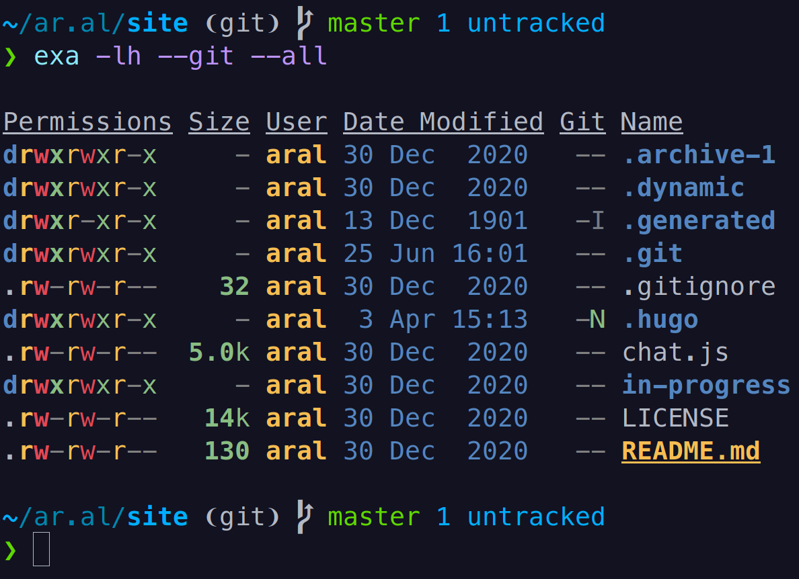

# Gills



Gills is a very simple Fish shell plugin that adds an empty line after your prompt and before the output of your command to balance the whitespace around them so you can more easily separate your prompts from your command output while skimming your terminal’s scrollback buffer.

It also handles a couple of special cases like `cd`, `pushd`, and `popd` that do not produce any output. In those cases, it doesn’t add the additional empty line. If you find any other edge cases, please feel free to open an issue or a pull request.

_It’s called gills because it gives your output room to breathe. Get it? (Sorry.)_

## Install

Install using [Fisher](https://github.com/jorgebucaran/fisher):

```shell
fisher install small-tech/gills
```

## How it works

Technically, like basically everything else in Fish shell, [it’s just a function](https://zerokspot.com/weblog/2016/01/16/fishy-functions/) that handles Fish shell’s `fish_postexec` event.

## Like this? Fund us!

[Small Technology Foundation](https://small-tech.org) is a tiny, independent not-for-profit.

We exist in part thanks to patronage by people like you. If you share [our vision](https://small-tech.org/about/#small-technology) and want to support our work, please [become a patron or donate to us](https://small-tech.org/fund-us) today and help us continue to exist.

## Copyright

Copyright &copy; 2021-present [Aral Balkan](https://ar.al), [Small Technology Foundation](https://small-tech.org).

## License

Gills is released under [ISC](./LICENSE).
